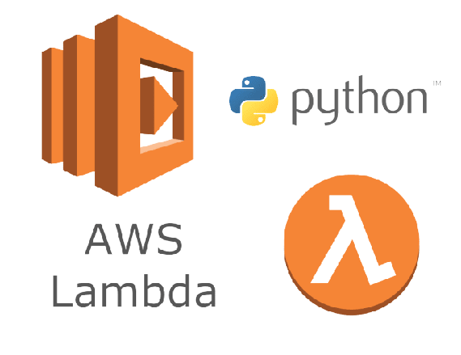

# spring-boot-req-to-aws-lambda
Simple application to make a post request to an aws lambda function with a function URL (new feature) attached to it. and mess with the JSON sent and received

## Setup
 - First acces the aws console and go to the Lambda section
 - Then create a lambda function on the top right 

 
 
 - Then set the name whatever you want, and the runtime Python 3.X  
 (as of the day this is being published, there are 4 python versions available: 3.6, 3.7, 3.8 and 3.9) 
 - After that, click on advanced settings
 

 - To end this tiring setup click on Enable Function URL, and then configure authentification and CORS, but for this little demo, lets make things easier and lets leave authentification None and CORS disabled. But remember, if this is being used in any other context, this should be configured in a safe way

 ### Now you are all set to get the function URL endpoint generated and put it in the Java code, then you are good to go
